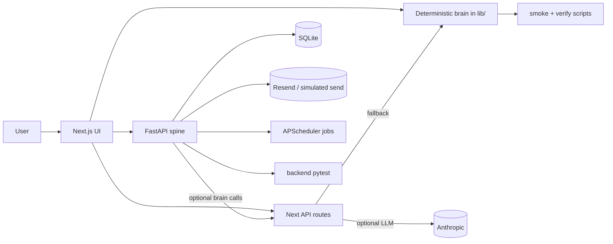

# AI GTM Campaign Builder - Codebase Briefing

This document is the repo-level map for understanding the product, the code, and the reasoning behind the architecture. It is written for presentation prep and team briefing, not as a chat transcript.

## One-line summary

AI GTM Campaign Builder turns a website or product description into campaign intelligence: strategy, ICP filters, buying signals, a two-step sequence, reply routing, tracking, learning, and an improved next campaign.

The product is deliberately framed as **campaign intelligence, not campaign sending**.

## Why the code is shaped this way

The central design choice is deterministic-first.

That means:

1. The product works offline with no API keys.
2. The core campaign logic lives in pure TypeScript under `lib/`.
3. FastAPI handles durable I/O, persistence, and gated live integrations.
4. Optional LLM routes enhance the experience but always fall back to deterministic code.

This matters because the demo has to be reliable in a hackathon setting, explainable in a team briefing, and safe to run even when live services are unavailable.

## System map

## How the product works end to end

The user-facing loop is:

1. Provide a website URL or product description.
2. Generate campaign strategy and ICP filters.
3. Turn that into a two-step outreach sequence.
4. Route replies into the right next action.
5. Track outcomes and learn from the campaign.
6. Produce the next campaign with better targeting and messaging.

The current repo extends that loop into:

- Inbox handling for inbound replies.
- Daily and weekly briefs.
- Gated real sending and webhook support.
- Agency and client-facing views.

## Where the code lives

| Area | What it owns | Why it exists |
| --- | --- | --- |
| `lib/` | Deterministic campaign brain | Single source of truth for product logic |
| `app/` | Routes and page shells | App Router UI and server routes |
| `components/` | Workspace UI | Composes the campaign, inbox, and briefs surfaces |
| `backend/` | FastAPI + SQLite spine | Persistence, scheduling, and live integrations |
| `scripts/` | Deterministic verification | Proves the loop without external dependencies |
| `data/` | Fixtures | Makes smoke and end-to-end checks repeatable |
| `docs/` | Handoff and operational docs | Keeps the working assumptions explicit |

## The deterministic brain in `lib/`

This is the most important part of the repo.

### `lib/campaign.ts`

This defines the canonical campaign state:

- input
- positioning
- strategy
- ICP filters
- buying signals
- sequence
- metrics
- learning insights
- next campaign recommendation
- agency workspace metadata
- pricing tiers

This file exists so the product has one source of truth for what a campaign is and how it evolves.

### `lib/scoring.ts`, `lib/routing.ts`, `lib/constants.ts`

These files turn detected leaks into scores and campaign angles.

They are the reason the app can answer questions like:

- Why did this account score highly?
- Why is this the recommended campaign angle?
- What leak is driving the recommendation?

That explainability is part of the product, not just a debug feature.

### `lib/strategy.ts`, `lib/outreach.ts`, `lib/seed.ts`, `lib/roi.ts`

These files generate the actual campaign motion:

- strategy generation
- two-step outreach copy
- seed/demo accounts
- recurring value and ROI framing

They exist to make the campaign feel like a working operating system, not a static report.

### `lib/reply-router.ts`, `lib/reply-conversation.ts`, `lib/reply-validators.ts`, `lib/validators.ts`

These files handle replies and the compliance rules around them.

- `reply-router.ts` classifies the inbound reply and chooses the next action.
- `reply-conversation.ts` turns that classification into a short reply draft.
- `reply-validators.ts` and `validators.ts` enforce copy constraints.

This layer exists because reply handling is part of campaign intelligence. The product should know whether a reply is a meeting request, an objection, an unsubscribe, or a routing problem, and it should do so in a way that remains compliant.

### `lib/brief.ts`

This builds daily and weekly campaign briefs from counts plus the existing campaign learning output.

It exists so the product can show recurring value over time, not just one-time outreach output.

### `lib/sending.ts`

This file owns the send guardrails.

It decides whether a reply or outbound action should be auto-sent or sent to review based on things like:

- suppression
- validation
- confidence
- daily caps
- sensitive intent
- account grade

That conservative stance is intentional. The product should never over-automate just because it can.

### `lib/llm.ts` and `lib/prompts.ts`

These files define the optional Anthropic-backed paths.

The code uses structured outputs and deterministic fallback logic so the demo remains functional without `ANTHROPIC_API_KEY`.

The LLM is a layer of polish and flexibility, not the system of record.

## The Next.js app

The App Router surfaces are thin and work-focused.

### Main routes

| Route | Purpose |
| --- | --- |
| `/` | Campaign landing and entry point |
| `/wizard` | 3-step campaign profile builder |
| `/review` | Accept or reject the generated profile |
| `/discover/[profileId]` | Contact discovery handoff |
| `/business/[profileId]` | Main campaign workspace |
| `/dashboard` | Saved profile recovery |
| `/dashboard/[profileId]` | Profile-specific contacts and export queue |
| `/inbox` | Reply inbox and thread review |
| `/inbox/[profileId]` | Profile-specific inbox view |
| `/briefs` | Brief overview and history |
| `/briefs/[profileId]` | Profile-specific briefs |

### UI composition

The page-level components in `components/` are arranged by workflow:

- `components/campaign-*` and `components/icp/*` cover profile creation and review.
- `components/workspace.tsx` and `components/business-profile-workspace.tsx` hold the main campaign surface.
- `components/inbox-workspace.tsx` handles inbound threads and reply drafts.
- `components/briefs-workspace.tsx` renders daily and weekly brief output.

This split keeps the UI narrow and task-oriented. The app is not trying to be a generic marketing dashboard.

## The FastAPI spine in `backend/`

The backend is the durable I/O layer.

### Entry point

- `backend/main.py` wires the app together.
- It creates the database, runs migrations, enables CORS for local dev, mounts routers, and starts the scheduler when enabled.

### Routers

| Router | Responsibility |
| --- | --- |
| `scrape.py` | Fixture-backed website analysis and URL ingestion |
| `profiles.py` | Campaign profile persistence and retrieval |
| `outreach.py` | Outreach queue and sequence export |
| `auth.py` | Demo-auth and session behavior |
| `sending.py` | Send jobs, caps, and review flow |
| `email.py` | Inbound email, simulate-inbound, unsubscribe |
| `threads.py` | Thread inbox views and actions |
| `briefs.py` | Brief generation and retrieval |

### Services

| Service | Responsibility |
| --- | --- |
| `website_analyzer.py` | Website/product analysis |
| `contact_discovery.py` | Deterministic contact discovery |
| `sends.py` | Send queue, caps, and send state |
| `esp_adapter.py` | Real or simulated email transport |
| `compliance.py` | Suppression, unsubscribe, and footer rules |
| `scheduler.py` | Background brief generation and other jobs |
| `thread_inbox.py` | Inbound thread processing and review actions |
| `briefs.py` | Brief aggregation and generation |
| `replies.py` | Drafting, validation, and send decision logic |
| `next_bridge.py` | Calls the Next.js brain routes when available |

### Why the backend exists

The backend is not duplicating the brain. It exists so the app can:

- persist campaign state
- manage sessions and review workflows
- handle inbound email
- enforce compliance and caps
- schedule briefs
- integrate with real services when keys are present

If the live services disappear, the demo still runs because the backend falls back to deterministic behavior.

## Optional live integrations

The code treats external systems as enhancements:

- `ANTHROPIC_API_KEY` enables LLM help, but the deterministic fallback still works.
- `RESEND_API_KEY` enables real sending; otherwise sends are simulated.
- `RESEND_WEBHOOK_SECRET` enables verified inbound webhooks; otherwise use `simulate-inbound`.
- `SCHEDULER_ENABLED` turns on background jobs.

This is the right tradeoff for a presentation-safe demo. The product can look real without depending on live infrastructure.

## Verification scripts

These scripts are part of the product story because they prove the behavior:

- `npm run smoke` checks the deterministic brain.
- `npm run verify:campaign` checks the campaign creation and persistence loop.
- `npm run test:backend` checks the FastAPI spine.
- `npm run typecheck` and `npm run lint` keep the TypeScript side honest.
- `npm run build` proves the Next.js app still compiles.

If someone asks how the team knows the system works, these are the commands to point to.

## How to explain the architecture in a presentation

Use this language:

1. The product does not just send emails. It decides who to target, why now, what to say, how to respond, and what to improve next.
2. The deterministic `lib/` layer is the source of truth, so the product works offline and is easy to explain.
3. The backend is the durable system for persistence, email, scheduling, and compliance.
4. LLM routes are optional and always backed by deterministic fallbacks.
5. The recurring value is in tracking, learning, briefs, and campaign memory, not in one-off generation.

## Caveats to state explicitly

- Some internal legacy names still use ICP terminology, even though the product surface is now campaign-first.
- The app intentionally does not ship CRM integration, billing, or a large lead database.
- Live email requires the right keys and infrastructure; the demo does not.
- A few backend deprecation warnings remain in dependencies, but they do not block the current flow.

## Suggested reading order

If you want to understand the code in the least confusing order, read it like this:

1. `README.md`
2. `lib/campaign.ts`
3. `lib/routing.ts`, `lib/reply-router.ts`, `lib/brief.ts`
4. `backend/main.py`
5. `backend/services/thread_inbox.py` and `backend/services/briefs.py`
6. `app/page.tsx`, `app/business/[profileId]/page.tsx`, `app/inbox/page.tsx`, `app/briefs/page.tsx`
7. `scripts/smoke.ts` and `scripts/verify-campaign-flow.ts`

That path shows the product story before the implementation details.
